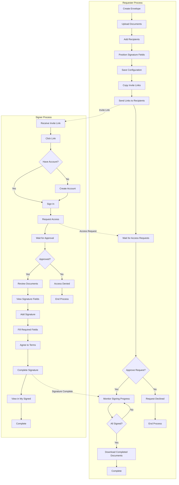

# E Sign - User Manual

## Welcome

E-Signing System is a secure digital signature platform that makes document signing fast, easy, and legally binding. This guide will walk you through how to use our platform as either a document sender (requester) or a document signer.

---

## Getting Started

### Landing Page Experience

1. **Visit Our Website**
   - Start at our beautiful landing page with animated elements
   - Learn about our key benefits: "Digitally Sign Documents"
   - See our tagline: "Instantly sign documents online—fast, secure, and legally binding. No hassle, just signatures."

2. **Explore Features**
   - View our hero section highlighting the main value proposition
   - If you're already signed in, see your recent envelopes
   - Navigate through our intuitive interface

3. **Get Started**
   - Click "Sign Up" to create a new account
   - Or click "Sign In" if you already have an account
   - Access the platform through our secure authentication system

### Creating Your Account

1. **Visit the Registration Page**
   - Go to our website and click "Sign Up"
   - Enter your full name, email address, and create a password
   - Read and agree to our Terms of Service and Privacy Policy
   - Click "Create Account"

2. **Sign In to Your Account**
   - Enter your email and password
   - If you have two-factor authentication enabled, enter the verification code sent to your email
   - You'll be automatically redirected to set up your signature

3. **Set Up Your Signature**
   - Create your digital signature using our signature pad
   - You can draw your signature, type it, or upload an image
   - This signature will be used for all your future document signings
   - You can skip this step and set it up later

---

## Understanding Your Role

In E-Sign System, you can be both a **requester** and a **signer** depending on the situation:

- **As a Requester**: When you create an envelope and send documents for others to sign
- **As a Signer**: When someone sends you documents to sign

The same person can be both - you might create envelopes for others to sign, and also receive signing requests from others.

---

## Creating and Managing Envelopes (Requester)

### Step 1: Create a New Envelope

1. **Navigate to Envelopes**
   - From the main navigation, click on "Envelopes"
   - Click "Create New" or "Add Envelope"
   - Give your envelope a title and description
   - This helps you and your signers identify the documents

2. **Upload Your Documents**
   - Upload PDF files to your envelope
   - Each file is securely stored and encrypted
   - You can upload multiple documents to the same envelope
   - Supported format: PDF files up to 10MB each

### Step 2: Add Recipients and Signature Fields

1. **Add Recipients**
   - For each document, add recipients who need to sign
   - Enter their email addresses and names
   - Choose their role: Signer, Approver, or Viewer
   - You can add multiple recipients to the same document

2. **Position Signature Fields**
   - Click on your document where signatures are needed
   - Add signature boxes, text fields, dates, or checkboxes
   - You can make some fields required and others optional
   - Assign each field to the appropriate recipient

3. **Save Your Configuration**
   - Save the field positioning for each document
   - Review all documents, recipients, and signature fields
   - Make sure all required information is complete

### Step 3: Share with Recipients

1. **Copy Invite Links**
   - For each recipient, copy their unique invite link
   - Each recipient gets a secure, personalized link
   - The link contains all the information they need to access the document

2. **Send the Links**
   - Send the invite links to your recipients via email, messaging, or any method you prefer
   - Each recipient will receive a secure link to access their documents
   - You can track who has accessed the invitation

3. **Monitor Progress**
   - Check your envelope status to see who has requested access
   - Approve or decline access requests from recipients
   - Track signing progress in real-time

---

## Receiving and Signing Documents (Signer)

### Step 1: Receive Your Invitation

1. **Get the Invite Link**
   - You'll receive a secure link from the document sender
   - The link is unique to you and the specific document
   - Click the link to access the signing page

2. **Request Access**
   - If you don't have an account, you'll be prompted to create one
   - If you already have an account, just sign in
   - Request access to the envelope you've been invited to

3. **Wait for Approval**
   - The envelope creator will review your access request
   - You'll be notified once your access is approved
   - Then you can proceed to sign the documents

### Step 2: Review and Sign the Documents

1. **Review the Documents**
   - Take time to read all documents carefully
   - Make sure you understand what you're signing
   - Contact the sender if you have any questions

2. **See Your Signature Fields**
   - Your signature fields will be highlighted on the document
   - Required fields are marked clearly
   - You can see what information you need to provide

3. **Add Your Signature**
   - Use our signature pad to draw your signature
   - Or type your name in a signature font
   - Or upload an image of your signature

4. **Fill in Required Fields**
   - Click on each signature field to add your signature
   - Fill in any text fields, dates, or other information
   - You can edit your signature if needed

5. **Complete the Signing**
   - Review all your signatures and information
   - Agree to the terms and conditions
   - Click "Complete Signature"

---

## Managing Your Documents

### For Document Requesters

1. **View Your Envelopes**
   - Go to the "Envelopes" section to see all your created envelopes
   - Track the status of each envelope and document
   - See who has signed and who still needs to sign

2. **Monitor Progress**
   - Check recipient status: Pending, Requested, Approved, or Signed
   - Approve or decline access requests from recipients
   - Send reminders if needed

3. **Download Completed Documents**
   - Once all recipients have signed, download the completed documents
   - All documents include a certificate of completion
   - Keep your signed documents for your records

### For Document Signers

1. **View Your Signed Documents**
   - Go to "My Signed" to see all documents you've signed
   - Access your signing history and completed documents
   - Download copies of signed documents

2. **Track Your Activity**
   - See when you signed each document
   - View the envelope details and other participants
   - Access a complete audit trail of your signing activity

---

## Platform Navigation

### Main Sections

1. **Home Dashboard**
   - View recent envelopes and activity
   - Quick access to create new envelopes
   - Overview of your signing status

2. **Envelopes**
   - Manage all your document envelopes
   - Create new envelopes
   - Track signing progress
   - View envelope details and recipient status

3. **My Signed**
   - View documents you've signed
   - Access your signing history
   - Download completed documents
   - Track your signing activity over time

4. **Profile & Settings**
   - Update your personal information
   - Manage your default signature
   - Change password and security settings

5. **Profile & Settings**
   - Update your personal information
   - Manage your default signature
   - Change password and security settings

---

## Key Features

### Security & Compliance

- **Bank-level security** for all documents and signatures
- **Legally binding signatures** that meet legal requirements
- **Complete audit trail** of all signing activities
- **Encrypted storage** to protect your documents

### Ease of Use

- **No software to install** - works in any web browser
- **Mobile-friendly** - sign documents on your phone or tablet
- **Real-time updates** so you always know the status
- **Simple invite system** - just copy and share links

### Professional Features

- **Multiple signature types** to match your needs
- **Field positioning** for precise signature placement
- **Recipient management** with role-based access
- **Document history** and audit trails

---

## Workflow Summary

### As a Requester:

1. Create envelope → Upload documents → Add recipients and fields → Copy invite links → Send to recipients → Approve access requests → Monitor signing progress → Download completed documents

### As a Signer:

1. Receive invite link → Request access → Wait for approval → Review documents → Sign fields → Complete signature → View in My Signed

---

## Process Flowchart

### Complete Document Signing Workflow

---

## Getting Help

### Support Options

- **Help Center**: Find answers to common questions
- **Email Support**: Contact our support team
- **Video Tutorials**: Learn how to use specific features

### Best Practices

- **Always review documents** before signing
- **Keep your contact information updated**
- **Use strong passwords** for your account
- **Contact the sender** if you have questions about documents
- **Save invite links** for future reference

---
